# LatAmProof - Revolutionizing Financial Inclusion in Latin America

## 🌟 What We're Building

**LatAmProof** is a groundbreaking solution that bridges the gap between traditional identity verification and modern financial services in Latin America. We're creating a system where people can prove who they are, where they're from, and what they're worth - all through blockchain technology.

### 🎯 The Problem We're Solving

In Latin America, millions of people are **financially invisible**. They can't get loans, open bank accounts, or access credit because:

- **No Credit History**: Traditional banks require years of banking relationships
- **No Income Verification**: Informal employment makes it impossible to prove earnings
- **No Identity Trust**: Fraud and duplicate identities create distrust
- **Geographic Barriers**: Rural areas lack access to financial services

### 💡 Our Solution

We combine **government-verified identities** with **ENS (Ethereum Name Service)** to create a new kind of financial passport. Think of it as a digital wallet that proves:

- ✅ You are who you say you are (government-verified)
- ✅ You're from where you claim (country-specific verification)
- ✅ You have the income/assets you claim (ENS records as proof)

## 🚀 How It Works

### 1. **Identity Verification** 🔐

Users go through a government-verified identity check using Self.xyz technology. This creates a **zero-knowledge proof** that proves their identity without revealing personal details.

### 2. **ENS Domain Creation** 🌐

Each verified user gets an ENS domain (like `juan.argentina.eth`) that serves as their **digital identity wallet**.

### 3. **Proof of Income & Assets** 💰

Users can store financial documents in their ENS domain using:

- **Text Records**: For storing metadata like income ranges, employment status
- **Content Hash**: For storing encrypted documents like tax returns, bills, bank statements

### 4. **Credit Scoring** 📊

Financial institutions can verify income and assets through ENS records to calculate credit scores, all while maintaining user privacy.

## 💼 Real-World Use Cases

### 🏦 **Credit Scoring & Lending**

```
Traditional Way:
❌ No bank account = No credit history = No loans

With LatAmProof:
✅ ENS domain shows verified income = Instant credit score = Loan approval
```

**Example**: Maria from rural Mexico has been selling crafts for 5 years but can't get a loan. With LatAmProof:

1. She verifies her identity through government records
2. Gets `maria.mexico.eth` domain
3. Stores her craft business income records in ENS text records
4. Banks can verify her income without seeing personal details
5. Gets approved for a business loan

### 🏠 **Mortgage Applications**

```
Traditional Way:
❌ Need 2+ years of W2s, bank statements, tax returns
❌ Process takes 3-6 months

With LatAmProof:
✅ All documents stored in ENS domain
✅ Instant verification
✅ Process takes days, not months
```

### 💸 **Microfinance & Remittances**

- **Instant Identity Verification**: No need for physical documents
- **Cross-Border Trust**: Verified identity works across all LATAM countries
- **Lower Fees**: Reduced fraud means lower transaction costs

### 🏛️ **Government Services**

- **Disaster Relief**: Only verified residents can claim funds
- **Social Programs**: Prevent duplicate applications
- **Voting Systems**: One verified identity = one vote

# LatAmProof: Self.xyz + ENS Registration Flow

```mermaid
sequenceDiagram
    participant User
    participant Frontend
    participant SelfHub as Self.xyz Hub
    participant LatAmProof as LatAmProof Contract
    participant L2Registry as L2 Registry
    participant ReliefFund as Disaster Relief Contract

    User->>Frontend: Start Verification
    Frontend->>SelfHub: Submit Government ID
    SelfHub->>SelfHub: Validate & Generate ZK Proof

    SelfHub->>LatAmProof: onVerificationSuccess(output, userData)
    LatAmProof->>LatAmProof: customVerificationHook()

    LatAmProof->>L2Registry: Create ENS Subdomain
    L2Registry-->>LatAmProof: Domain Created

    LatAmProof->>L2Registry: Set Address Resolution
    LatAmProof-->>Frontend: Verification Complete

    Frontend->>User: Show ENS Domain: leo.arg.eth

    Note over User,ReliefFund: Using the ENS Domain for Relief Funds

    User->>Frontend: Claim Disaster Relief
    Frontend->>ReliefFund: Claim Relief (leo.arg.eth)
    ReliefFund->>LatAmProof: isUserVerifiedForCountry(user, "ARG")
    LatAmProof-->>ReliefFund: ✅ Verified for Argentina
    ReliefFund->>ReliefFund: Process Relief Claim
    ReliefFund-->>Frontend: Relief Funds Sent
    Frontend->>User: Relief Claim Successful!
```



## 🔄 Simple Flow

1. **User starts verification** with government ID
2. **Self.xyz validates** and creates zero-knowledge proof
3. **Smart contract receives** verification and creates ENS domain
4. **User gets** their country-specific ENS domain
5. **Ready to use** for financial applications

## 💡 What Happens

- **Self.xyz**: Handles government credential verification
- **LatAmProof**: Receives verification and manages ENS creation
- **L2 Registry**: Creates the actual ENS domain
- **Result**: User gets `leo.arg.eth` domain for financial services

## 🏦 Relief Fund Verification

- **User claims** disaster relief using their ENS domain
- **Relief contract** calls `isUserVerifiedForCountry(user, "ARG")`
- **LatAmProof** confirms verification status
- **Funds released** only to verified Argentinian users
- **ENS domain** serves as proof of identity and nationality

_LatAmProof: Where identity meets opportunity_ 🚀
